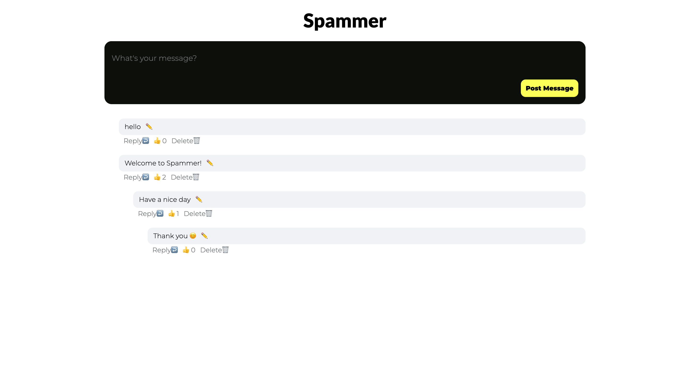

# 💬 Spammer App

## :star: App Overview

The Spammer App is a project where you can:

- ✉️ Post new messages
- ❤️ Add likes to each message
- ✏️ Edit messages
- 🗑️ Delete messages
- ↩️ Reply to any message

#### LIVE LINK: https://spammer-messages-project.netlify.app/

## :camera: Screen Shots



## :computer: Technologies Used

[](https://skillicons.dev)

## 📚 What I Learned During This Project

- This simple yet powerful app served as an excellent playground for practicing CRUD (Create, Read, Update, Delete) operations.

- I gained valuable experience in working with various HTTP methods like GET, POST, CREATE, and DELETE when making API calls.

## 🔄 The Challenge And The Solution:

- One of the exciting challenges I encountered was implementing nested reply messages functionality.
- To address this challenge, I had to devise a solution that allowed a component to call itself when rendering a nested reply. This recursive approach was key to achieving the desired functionality.

## :wrench: Setup

1. Clone this repository

```bash
$ git clone https://github.com/giangpham-cfg/Spammer-project.git
```

2. Go into the repository

```bash
$ cd Spammer-project
```

3. Install dependencies

```bash
$ npm install
```

4. Run the app

```bash
$ npm run dev
```

## :blue_book: License

[MIT](https://choosealicense.com/licenses/mit/)
